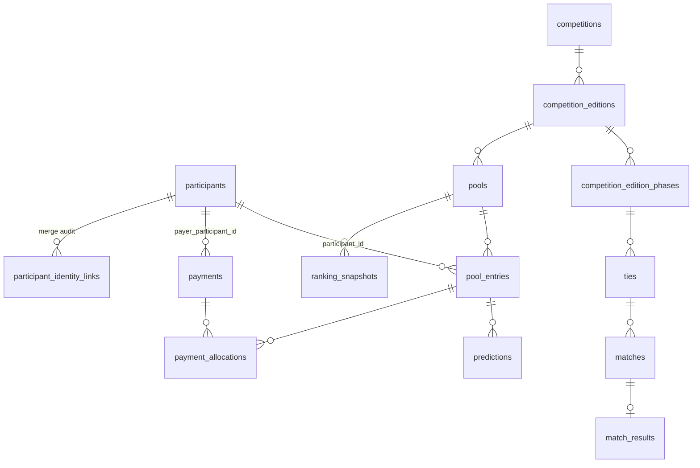

# ARCHITECTURE_DECISION_REVIEW — independent review board

**STATUS:** COMPLETE as a review. **No decision here is ratified; nothing is implemented.**
**EVIDENCE BASIS:** all Phase 1/1B sanitized evidence; `DATABASE_RECONCILIATION.md`,
`LOGICAL_DATA_MODEL_ASIS.md`, `JSON_CLASSIFICATION.md`, `DEPENDENCY_GRAPH.md`,
`RLS_ASSUMPTIONS_REVIEW.md`, `TECHNICAL_DEBT_REPORT.md`, `DATA_GOVERNANCE.md`,
`NAMING_STANDARDS.md`, `OBSERVABILITY_MODEL.md`, and the five existing ADRs in `docs/bolao/adr/`.
**KNOWN GAPS:** no load figures, no growth projection, no budget, no team-size constraint. Every
effort estimate is therefore ordinal, not calendar.
**ASSUMPTIONS:** single maintainer; no dedicated ops; real money per pool; correctness outranks
elegance.

**Review posture:** the proposed target model is **not** rubber-stamped. Two of its thirteen
proposed tables are rejected as premature, one is renamed, four are added, and the migration
sequencing in the task prompt is challenged as unsafe in its stated order.

---

## 1. Decisions inherited from existing ADRs — re-challenged

### DEC-01 · Vanilla JS, no framework, no build step (ADR-001, accepted)
**EVIDENCE:** 12 822 lines across three `app.js` files; zero build tooling; GitHub Pages hosting.
**ASSUMPTIONS:** a single maintainer; longevity over velocity.
**PROS:** no supply chain, no build breakage, readable in 10 years, deploys by `git push`, zero
dependency CVEs.
**CONS:** merge/tombstone logic reimplemented three times (T-15); no type checking on the money path;
no module system.
**FAILURE MODES:** a shared-logic bug must be fixed three times and one copy gets missed. This
already happened once — the `cutoffOffsetMs` merge drop (J-06).
**ALTERNATIVES:** (a) extract a shared vanilla ES module — no build step required; (b) adopt a
framework; (c) status quo.
**RECOMMENDATION:** **Uphold ADR-001, but reject the "therefore duplicate" corollary.** (a) is
available without violating any premise: ES modules work natively on Pages. The three apps should
share merge/tombstone/audit primitives. This is the single highest-value refactor available and it
does not require abandoning the ADR.
**CONFIDENCE:** HIGH.

### DEC-02 · Read-merge-write without compare-and-swap (ADR-002, accepted with known limitation)
**EVIDENCE:** `bolao_state` has **no version column** (`LOGICAL_DATA_MODEL_ASIS.md` §2) while four
`lottery_*` tables *do* have `version integer`. Production shows **532 updates on 3 rows**.
**ASSUMPTIONS:** concurrent admin writers are rare.
**PROS:** simple; works offline; no server needed; the ADR is honest about the gap.
**CONS:** lost-update is *possible by construction*, on the money-bearing table, and the loss is
silent — no error, no metric, no audit entry.
**FAILURE MODES:** two admins editing during a live match; one's change vanishes. With 532 updates
and a `*/10` cron cadence in live windows, the concurrency window is not hypothetical.
**ALTERNATIVES:** (a) add `version`/`updated_at` optimistic concurrency — PostgREST supports
`If-Match`-style conditional updates via a version predicate; (b) move writes server-side (DEC-11);
(c) accept.
**RECOMMENDATION:** **Challenge "accepted".** (a) is a small, additive, reversible change to a
3-row table and closes a silent-data-loss class on the money path. The relational half of the same
database already does this. Accepting a known lost-update on money because it is "rare" is the
weakest decision in the current set.
**CONFIDENCE:** HIGH.

### DEC-03 · Official vs. provisional results (ADR-003, accepted)
**EVIDENCE:** two scoring displays; BR2026 projection model documented separately.
**RECOMMENDATION:** **Uphold, unchanged.** Correctly distinguishes provisional from final and the
UI language rules are already mandated. Carries forward cleanly into `match_results` +
`ranking_snapshots`. No change.
**CONFIDENCE:** HIGH.

### DEC-04 · Client-side audit log limitations (ADR-004, accepted with explicit limitation)
**EVIDENCE:** `auditLog` written client-side, **truncated to 200 entries** (`app.js:671`), no
server-side integrity.
**PROS:** honest documentation of a real limitation — genuinely good practice.
**CONS:** **the ADR accepts "not tamper-proof" but the 200-cap is a different property: silent,
permanent history loss.** Those are not the same concession, and conflating them means an accepted
limitation is shielding an unaccepted defect.
**FAILURE MODES:** the oldest 200+ admin actions are already gone and no one knows how many. Because
`unshift` puts newest first, truncation destroys the *oldest* evidence — precisely what a dispute
would need.
**ALTERNATIVES:** (a) raise/remove the cap; (b) append-only `audit_events` table; (c) keep.
**RECOMMENDATION:** **Amend ADR-004 to separate the two claims, and treat the cap as a defect, not a
limitation.** Interim: remove the cap (cheap). Target: (b). This is the one item in this review
that is actively destroying data every day.
**CONFIDENCE:** HIGH.

### DEC-05 · Scoring rule versioning (ADR-005, accepted and implemented)
**EVIDENCE:** version stamped per scored entry; four independent `audit_scoring.py` suites, all
passing, all different hashes.
**RECOMMENDATION:** **Uphold and protect.** This is the strongest engineering artefact in the repo.
Migration must not touch scoring; `predictions` normalisation (JSON step 5) must carry a parity
proof against these suites. Per-competition separation must **never** be generalised.
**CONFIDENCE:** HIGH.

---

## 2. The target data architecture — challenged table by table

### DEC-06 · `bolao_state` JSON → relational
**EVIDENCE:** `CONFIRMED_IN_USE`; 3 rows; three *incompatible* document schemas in one column
(J-01); no schema validation; `paid` is a bare boolean on a money path (J-03); PII duplicated per
entry per competition.
**ASSUMPTIONS:** the apps continue to exist and must not break.
**PROS:** enables reporting, constraints, referential integrity, real payments, uncapped audit,
per-column access control.
**CONS:** it is the live money path; three client apps read/write it directly; migration touches
scoring-adjacent data.
**FAILURE MODES:** a half-migrated state where JSON and tables disagree and neither is authoritative
— by far the most dangerous outcome available in this programme.
**ALTERNATIVES:** (a) full normalisation; (b) **hybrid** — normalise identity/entries/payments/audit,
keep tournament-shaped payloads (`picks`, `phases`, `espnSync`) as JSONB columns; (c) keep JSON, add
a validating schema + `version`; (d) do nothing.
**RECOMMENDATION:** **(b) hybrid.** Full normalisation of `picks` buys little (it is read whole,
per entry, and scoring already works) while risking the untouchable subsystem. Normalise what needs
constraints, joins and access control — identity, entries, payments, audit — and keep genuinely
document-shaped data as JSONB *columns inside relational rows*. Reject (a) as over-reach and (d) as
unsustainable.
**CONFIDENCE:** MEDIUM-HIGH. Weakness: no growth data, so the "picks stay JSON" call could invert if
cross-entry prediction analytics becomes a requirement.

### DEC-07 · Global participant identity — **the central question**
**EVIDENCE:** a person entering all three 2026 competitions exists as **three unrelated records with
no linking key** (`JSON_CLASSIFICATION.md` §3). `participantEmail` is the only plausible natural key
and is **nullable** in both the JSON and `lottery_participants`. `payerName` ≠ `entryName` is already
modelled, proving payer and participant are distinct roles.
**ASSUMPTIONS:** the same human across competitions *should* be one record; email is stable enough
to deduplicate.
**PROS:** every stated reporting goal (participation history, pools entered, total paid, performance
across competitions, year-over-year) becomes a join instead of an impossibility. PII stored **once**,
which is simultaneously the governance fix (`DATA_GOVERNANCE.md` §6 right-of-access) and the
modelling fix.
**CONS:** identity resolution across three historical datasets is genuinely hard; a wrong merge
attributes one person's money to another; a wrong split fragments history.
**FAILURE MODES:** (i) email null or shared (couples, family) ⇒ under-merge or wrong merge;
(ii) name-only matching on Brazilian names with accents/abbreviations ⇒ false merges;
(iii) merging is easy to do and **very** hard to undo once payments are attached.
**ALTERNATIVES:** (a) auto-dedup on normalised email; (b) **surrogate `participant_id` +
operator-confirmed merge, with an explicit `participant_identity_links` audit of every merge**;
(c) per-competition participants, no global identity (status quo).
**RECOMMENDATION:** **(b), and adopt the participant-master model.** The requirement is sound and
evidence-backed. But **automatic dedup must be rejected**: with a nullable email and real money
attached, a false merge is a financial error. Every merge must be an audited, reversible operation
with the pre-merge identities retained. Backfill starts with *zero* merges — one participant per
historical entry — and merges only on operator confirmation. Under-merging is recoverable;
over-merging is not.
**CONFIDENCE:** HIGH on the model, HIGH on rejecting auto-dedup.

### DEC-08 · `pool_entries`, `payments`, `payment_allocations`
**EVIDENCE:** `payerName` ≠ `entryName` in live JSON; `lottery_payment_transactions` already models
amount/type/`external_reference` (unique, **enforced** — 11 probes on 11 inserts)/reversal self-FK.
**PROS:** allocation expresses the real many-to-many (one payment settles several entries; one entry
settled by several payments). Reversals already modelled. `paid` becomes *derived*, not stored.
**CONS:** more tables; allocation invariant (`sum(allocated) = amount`) must be enforced, not assumed.
**FAILURE MODES:** partial allocation silently leaving an entry unpaid; double-allocating one payment
across two entries.
**ALTERNATIVES:** (a) `payments` only, with a nullable `entry_id`; (b) payments + allocations;
(c) keep the boolean.
**RECOMMENDATION:** **(b), with `O-17` (allocation-sum invariant) as a hard constraint plus a
monitor.** (a) cannot express split payments and would need rework the first time someone pays for
two people — which `payerName` shows already happens. Reject (c): it cannot satisfy the txId
governance rule the project already imposes on itself.
**CONFIDENCE:** HIGH.

### DEC-09 · Competition abstraction: `competitions` + `competition_editions`
**EVIDENCE:** three apps, three tournament shapes (group+knockout / league table / pure knockout);
CDB needs per-phase cutoffs; scoring is deliberately per-competition.
**PROS:** year-over-year reporting requires separating the durable tournament from one running of it.
**CONS:** genuine risk of over-abstraction — a generic model that fits all three tournaments would
have to encode bracket, league and knockout rules generically, and the repo **explicitly forbids**
generalising tournament logic.
**FAILURE MODES:** an abstraction so general it expresses nothing, and scoring logic leaking into it.
**ALTERNATIVES:** (a) fully generic competition engine; (b) `competitions` + `competition_editions`
+ `competition_edition_phases` for *identity and scheduling only*, with tournament-specific
structure kept per competition; (c) no abstraction.
**RECOMMENDATION:** **(b), with a hard boundary: the competition tables carry identity, edition,
phase and schedule — never rules, scoring or advancement.** Reject (a) explicitly; it violates
repo governance and is the classic failure of this kind of migration.
**CONFIDENCE:** HIGH.

### DEC-10 · `matches`, `ties`, `match_results`, `predictions`, `ranking_snapshots`
**RECOMMENDATION with modifications:**
- **`matches`** — accept (reject `fixtures`: already means *test fixture* here).
- **`ties`** — **add** (absent from the proposal). A two-legged tie has aggregate and qualification
  rules and is not a match; `phases[].ties` models a real thing.
- **`match_results`** — accept, **renamed** from `results` to disambiguate from participant scores.
- **`predictions`** — accept **but defer**. Touches scoring; must be last and carry a parity proof.
- **`ranking_snapshots`** — accept **only with the `_snapshots` suffix**. Ranking is currently
  correctly *derived* (`DEPENDENCY_GRAPH.md`); a table named `rankings` would become a de-facto
  source of truth within one release. The suffix is load-bearing.
- **`audit_events`** — accept; see DEC-12.
- **`outbox_events`** — accept; see DEC-13.
- **`sync_state`** — **add**. `espnSync` has nowhere else to live.
- **`competition_edition_phases`** — **add** (per-phase cutoffs).

### DEC-11 · RLS model and the write path
**EVIDENCE:** `anon` holds full DML on all 7 tables; `PUBLIC` has schema `USAGE`; the one in-use
table's 6 policies are **non-identity-based**; anon key hardcoded in 2 tracked scripts; RLS enabled
by an *undeclared* event trigger (R-08); 5 roles hold `BYPASSRLS`.
**FAILURE MODES:** anyone with the anon key can write the money-bearing table subject only to a
non-identity condition. Admin and public are the **same** database principal, so PII access is
unattributable (`DATA_GOVERNANCE.md` G-04).
**ALTERNATIVES:** (a) tighten RLS policies, keep direct table writes; (b) **browser reads
`security_invoker` views; all writes via SECURITY DEFINER RPCs; revoke table DML from `anon`**;
(c) status quo.
**RECOMMENDATION:** **(b), and the revoke must land in the same change as the RPC.** (a) is
insufficient — RLS cannot express "only the admin may do this" when admin is not a database
principal. Critically: **introducing RPCs while table grants remain leaves two write paths, the
weaker of which bypasses every new control**, making the mediation cosmetic. The 19 declared,
unapplied `admin_*` RPCs are already most of this design.
**CONFIDENCE:** HIGH.

### DEC-12 · Audit model
**EVIDENCE:** two partial implementations — JSON `auditLog` (capped, client-side) and
`lottery_admin_audit` (hash columns, **no enforcement**, UPDATE/DELETE unblocked, 1 row).
**PROS of the relational design:** its column set (actor snapshot, before/after, reason,
`request_id`, `correlation_id`, `source`, `client_metadata`, hash chain) is genuinely well designed
and worth generalising.
**FAILURE MODES:** today the schema *advertises* tamper-evidence it does not have — worse than no
audit table, because a reviewer would reasonably assume the control works.
**ALTERNATIVES:** (a) enforce the chain with triggers; (b) drop the hash columns and be honest;
(c) status quo.
**RECOMMENDATION:** **(a) — and resolve `DATA_GOVERNANCE.md` G-02 *before* building it.** The
right-to-erasure conflict means the hash chain must cover **non-PII fields only**, so PII can be
redacted in place without breaking the chain. Deciding this *after* the append-only table exists
means rewriting an append-only log, which is by definition impossible. **This is the single
highest-priority build-order constraint in the programme.** Reject (b): the columns are right;
only enforcement is missing. Cost is near zero now (1 row) and rises per row.
**CONFIDENCE:** HIGH.

### DEC-13 · Outbox
**EVIDENCE:** outbox is a **Git-tracked JSON file** with 19 real addresses; email sent from two
independent paths (browser EmailJS, runner Python) with no shared ledger; no retry, no idempotency,
no DLQ anywhere; `lottery_email_jobs`/`lottery_email_deliveries` declared but never applied.
**FAILURE MODES:** duplicate result emails to real participants (reputational); silent non-delivery
(the Powerball cron class); no way to answer "was this person notified?".
**RECOMMENDATION:** **Adopt `outbox_events` with a mandatory idempotency key, bounded retry with
backoff, an explicit `dead` terminal state, and delivery attempts recorded as child rows.** Because
GitHub Actions gives at-least-once execution with jitter, **idempotency is mandatory, not
optional** — a duplicate send is the likely failure, not a lost one. Unify both send paths onto one
ledger; two paths with one ledger is acceptable, two paths with two ledgers is not.
**CONFIDENCE:** HIGH.

### DEC-14 · Event sourcing — **rejected**
**EVIDENCE:** 3 rows in the in-use table; ~500 KB total; single maintainer; no replay requirement
stated; `audit_events` already captures before/after.
**PROS of full ES:** perfect history, temporal queries, replay.
**CONS:** enormous complexity — projections, versioning, replay tooling — for a dataset of this size;
scoring would become a projection, which endangers the most protected subsystem.
**RECOMMENDATION:** **Reject full event sourcing. Adopt an append-only event *log* instead.**
Classification: **commands** = admin actions (`admin_record_payment`, …); **events** = `audit_events`
rows (past-tense facts); **aggregates** = participant, pool entry, payment; **snapshots** =
`ranking_snapshots`; **projection candidates** = ranking, standings, payment balance. Getting the
*vocabulary* is valuable; adopting the *machinery* is not. This is why `NAMING_STANDARDS.md` forbids
a bare `event` table name — it would invite the assumption that ES is in play.
**CONFIDENCE:** HIGH.

### DEC-15 · GitHub Pages + Supabase topology
**EVIDENCE:** static hosting, no server, REST-only access, 13 cron entries, no long-running process.
**PROS:** near-zero cost, no server to patch, trivial deploys, survives maintainer absence.
**CONS:** **no trusted execution context** — hence the anon key in the browser, the client-side admin
gate, and the absence of a place to run an outbox worker.
**FAILURE MODES:** every server-side control this review recommends needs a trusted runtime that the
topology does not provide.
**ALTERNATIVES:** (a) keep Pages + add Supabase Edge Functions for the trusted path; (b) keep Pages +
GitHub Actions as the trusted path; (c) adopt a real backend.
**RECOMMENDATION:** **(a)** — smallest change that supplies what is missing. Edge Functions are
request-scoped (suits RPC-mediated writes); Actions are batch-scoped (suits the outbox worker), so
(b) complements rather than replaces. Reject (c) as disproportionate.
**CONFIDENCE:** MEDIUM. This is the weakest-evidence decision here: no cost ceiling or operational
appetite was stated, and it is the one choice that adds a new runtime dependency.

### DEC-16 · Dual-write migration — **sequencing challenged**
**EVIDENCE:** the task prompt's order is *Preparation → Reference → Transactional → FKs → Indexes →
Backfill → Dual write → Read switch → Validation → Rollback → Cleanup*.
**CHALLENGE:** two problems with that order.
1. **Dual write after backfill is backwards for a live system.** Backfilling first, then enabling
   dual write, leaves a gap in which writes land only in JSON and the backfill is already stale.
   Correct order: **enable dual write → backfill historical → reconcile continuously → then switch
   reads.**
2. **Dual write from a browser is not achievable.** Dual write requires atomicity across two
   targets. Three independent client apps writing to two schemas cannot be made atomic. Therefore
   **DEC-11 (server-mediated writes) is a hard prerequisite for DEC-16** — not a parallel workstream.
**FAILURE MODES:** divergence with no authoritative side; partial writes; a rollback that cannot
restore because the JSON path drifted.
**RECOMMENDATION:** **Re-sequence: server-mediated writes (DEC-11) → dual write → backfill →
continuous reconciliation (O-30) with a zero-divergence gate → read switch → cleanup.** And
**nothing starts before R-03 is resolved**, because migration provenance is currently broken.
**CONFIDENCE:** HIGH on the re-sequencing; HIGH on the R-03 gate.

### DEC-17 · Backup and restore
**EVIDENCE:** three backup writers, **zero readers** (DG-01); backups are plaintext JSON on a laptop
containing 44 names + 23 emails each; `PHASE0_BACKUP_GATES.md` already specifies 8 gates including
encryption (G3) and isolated restore (G5) — **not implemented**.
**RECOMMENDATION:** **Uphold `PHASE0_BACKUP_GATES.md` as-is; do not author a competing V2.** It is
already correct and more detailed than a rewrite would be. Two amendments only: (i) a backup with no
tested restore path is an *untested assertion*, so G5 is the binding gate, not G2; (ii) capture
`bolao_state` and `ensure_rls` DDL into version control for **reproducibility and auditability** —
not as a precondition for the backup itself. *(Corrected: `pg_dump` is self-contained; see
`BACKUP_RESTORE_OPERATIONAL_DESIGN.md` §0.)*
**CONFIDENCE:** HIGH. *(This supersedes any need for a `BACKUP_STRATEGY_V2.md`; see §4.)*

---

## 3. Proposed target model — verdict

| Proposed | Verdict | Reason |
|---|---|---|
| `participants` | ✅ **ACCEPT** — the keystone | PII once; enables every reporting goal |
| `competitions`, `competition_editions` | ✅ ACCEPT | Required for year-over-year |
| `pools` | ✅ ACCEPT | |
| `pool_entries` | ✅ ACCEPT (retire "participation") | |
| `payments`, `payment_allocations` | ✅ ACCEPT both | `payerName` evidence |
| `matches` | ✅ ACCEPT | |
| `results` | ⚠️ **RENAME** → `match_results` | Disambiguate from scores |
| `predictions` | ⚠️ **ACCEPT BUT DEFER** | Scoring-adjacent; last, with parity proof |
| `ranking_snapshots` | ⚠️ ACCEPT **only** with `_snapshots` | Must not become a source of truth |
| `audit_events` | ⚠️ ACCEPT **after** G-02 decided | Redaction vs. hash chain |
| `outbox_events` | ✅ ACCEPT with idempotency mandatory | |
| — | ➕ **ADD** `ties` | A tie is not a match |
| — | ➕ **ADD** `competition_edition_phases` | Per-phase cutoffs |
| — | ➕ **ADD** `sync_state` | `espnSync` has no home |
| — | ➕ **ADD** `participant_identity_links` | Merges must be auditable and reversible |
| — | ❌ **REJECT** a generic tournament-rules table | Violates repo governance |
| — | ❌ **REJECT** full event sourcing | DEC-14 |

### Reporting questions — answerability under this model
Participation history by person ✅ · pools entered ✅ · multiple entries per pool ✅ (no unique
constraint on `(participant_id, pool_id)`) · total historical payments ✅ · payment allocation ✅ ·
winnings/prizes ⚠️ **needs a `prize_allocations` concept not yet in the model — gap** ·
cross-competition performance ✅ via `predictions` + `match_results` · audit trail ✅ ·
year-over-year ✅ via `competition_editions`.

**PII duplication:** eliminated — PII lives only in `participants`; `pool_entries` carries a FK.

---

## 4. Duplicate-recommendation check (anti-sprawl)

| Topic | Canonical artefact | Action taken |
|---|---|---|
| Backup strategy | `PHASE0_BACKUP_GATES.md` | **No V2 authored.** DEC-17 amends it in place rather than duplicating 8 gates. |
| PII field inventory | `PHASE0_PII_MAP.md` | `DATA_GOVERNANCE.md` references, never restates |
| Repo-wide PII detection | `scripts/audit_pii_repo_wide.mjs` | `HARDCODED_DATA_AUDIT.md` extends it; **no competing scanner proposed** |
| Visual/component consistency | `docs/bolao/CONSISTENCY_MATRIX.md` | Explicitly out of scope |
| Scoring rules | ADR-005 + 4 audit suites | Untouched by design |

## 5. RISKS of this review's own recommendations

- **DEC-11 + DEC-16 together are a large change to a live money path.** Sequenced wrongly they are more
  dangerous than the status quo. The re-sequencing in DEC-16 is the mitigation and is not optional.
- **DEC-07's merge policy is deliberately conservative** and will leave duplicate participants in the
  data for a while. That is the intended trade: under-merge is recoverable, over-merge is not.
- **DEC-15 adds a runtime dependency** (Edge Functions) on the weakest evidence in this document.
- This review recommends **no DDL, no migration and no production change**. Everything is gated on
  R-03, G-02, and explicit operator decisions.

## 6. NEXT DECISION (operator) — ranked

1. **Resolve R-03** (migration provenance). Gates everything.
2. **Decide G-02** (redaction vs. deletion in audit rows). Gates `audit_events` — and is
   irreversible once built.
3. **Ratify or reject "the browser never writes"** (DEC-11). Everything in the target write path
   follows from it.
4. **Approve the participant-master model with operator-confirmed merges** (DEC-07).
5. **Choose the trusted runtime** (DEC-15): Edge Functions, Actions, or neither.
6. **Amend ADR-002 and ADR-004?** Both are challenged here on evidence; both are currently "accepted".
