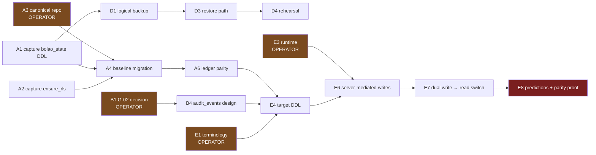

# AUDIT_READINESS — Big4-style assessment, readiness scorecard, and implementation backlog

**STATUS:** COMPLETE. Consolidates Tasks 17 (audit package), 18 (readiness scorecard) and 19
(implementation backlog) in one artefact — they share one evidence base and one priority ordering,
and splitting them would produce three documents restating the same findings.
**EVIDENCE BASIS:** every artefact in this directory plus sanitized Phase 1/1B evidence. No claim
here is new; each traces to a finding ID.
**KNOWN GAPS:** no external auditor has reviewed this. Scores are **self-assessed** against
conventional control expectations, not against a named framework (no SOC 2/ISO/PCI scope exists).
Effort is ordinal (S/M/L), not calendar — no team size or availability was stated.
**ASSUMPTIONS:** the reviewer is a competent engineer or auditor with **no prior knowledge of this
system's history** — the standard this programme was told to meet.

---

## 1. How a Big4 reviewer would open

Three questions get asked first, and the honest answers are uncomfortable:

1. **"Show me the schema this application runs on, from version control."**
   → Not possible. The money-bearing table has no versioned DDL (**R-07**); the DDL that does exist
   sits on an unmerged branch of a *different* repository (**R-01**); and the single applied
   migration maps to none of the six declared migration files (**R-03**).
2. **"Show me your audit trail."**
   → Two exist, neither works. The JSON log silently discards history at 200 entries (**J-04**); the
   relational one has hash-chain columns with no trigger computing or protecting them, and
   UPDATE/DELETE unblocked (**R-04**).
3. **"Show me a successful restore."**
   → None exists. Backups are produced by three scripts and read by none (**DG-01**).

**These three answers, not any individual technical defect, define current audit readiness.** Each is
a *traceability* failure rather than an availability failure — the system works; it cannot be
*evidenced*. That distinction is worth stating plainly, because it also means remediation is mostly
documentation and capture, not rebuilding.

### 1.1 What would genuinely impress a reviewer

Stated because a credible assessment is not uniformly negative:

- **Scoring discipline.** Four independent `audit_scoring.py` suites, all passing, deliberately not
  generalised; rule versioning stamped per scored entry (ADR-005). Money-affecting logic is the
  best-controlled part of the system.
- **Zero `SECURITY DEFINER` functions without a pinned `search_path`** across every schema — the
  highest-severity privilege-escalation shape is absent.
- **Payment-reference governance is provably holding**: zero leaks across three independent detection
  methods (`HARDCODED_DATA_AUDIT.md` §3).
- **Zero `TODO`/`FIXME`/`HACK`** in tracked code.
- **This programme's own evidence discipline** — read-only transactions, manifest-covered outputs,
  a fail-closed sanitization gate, raw evidence outside version control, self-corrections recorded
  rather than quietly fixed. A reviewer would score the *process* well above the *system*.

---

## 2. Scorecard (Task 17 + Task 18)

Scale 0–5: 0 absent · 1 ad-hoc · 2 partial/undocumented · 3 documented and working ·
4 controlled and evidenced · 5 continuously verified.

| # | Domain | Current | Target | Gap | Priority | Effort | Key finding IDs |
|---|---|---|---|---|---|---|---|
| 1 | **Architecture** | **2** | 4 | Two competing models in one schema; no trusted execution context | P1 | L | T-04, DEC-06, DEC-15 |
| 2 | **Security** | **2** | 4 | `anon` holds full DML on 7 tables; no identity-based policy on the in-use table; anon JWT in 2 tracked scripts | **P0** | M | O-1, O-2, H-01/H-02 |
| 3 | **Governance** | **1** | 3 | No retention enforced anywhere; erasure impossible; no privacy notice | P1 | M | G-01, G-02, G-03 |
| 4 | **Backup** | **2** | 4 | Backups exist, unencrypted, on a laptop; 8 gates specified, unimplemented. **A logical backup is unblocked and can be taken now** (`BACKUP_RESTORE_OPERATIONAL_DESIGN.md` §0) | **P0** | M | DG-01, `PHASE0_BACKUP_GATES` G3/G5 |
| 5 | **Traceability** | **1** | 4 | Schema not reproducible from VCS; migration ledger unmapped | **P0** | M | R-01, R-03, R-07, R-08 |
| 6 | **Recoverability** | **1** | 4 | No restore path has ever been exercised | **P0** | M | DG-01, O-05 |
| 7 | **Documentation** | **4** | 4 | Now genuinely strong — 13 cross-linked artefacts, findings ID'd, corrections recorded | — | — | this directory |
| 8 | **RLS / access control** | **2** | 4 | RLS on by accident (undeclared event trigger); admin is not a DB principal | **P0** | M | R-08, G-04, DEC-11 |
| 9 | **Data quality** | **2** | 4 | 10 expected constraints missing; every FK unindexed; unvalidated `jsonb` | P1 | M | M-1…M-10, T-25 |
| 10 | **PII** | **2** | 4 | PII duplicated per entry per competition; real emails in tracked files; PII in plaintext local backups | P1 | M | H-03, H-09, §3 of governance |
| 11 | **Observability** | **0** | 3 | No metrics, dashboards, alerts or log aggregation. Six known incidents were all silent | P1 | M | O-01…O-33 |
| 12 | **Change management** | **3** | 4 | Strong repo governance and QA checklists; weakened by DDL living outside the deployed repo | P2 | S | R-01, R-02 |

**Weighted view.** Unweighted mean ≈ **1.8 / 5**. But the five **P0** domains (security, backup,
traceability, recoverability, RLS) average **1.6**, and they are the ones that determine whether an
auditor issues findings or a qualified opinion. **Documentation at 4 is the outlier** — the system is
now far better *described* than *controlled*, which is the expected mid-programme shape and should
not be mistaken for progress on the underlying controls.

### 2.1 What moves the needle fastest

| Action | Domains improved | Effort | Why disproportionate |
|---|---|---|---|
| Capture `bolao_state` + `ensure_rls` DDL into VCS | 5, 1 | **S** | Turns "unreproducible" into "reproducible". Pure capture, zero production risk. |
| Remove the `auditLog` 200-cap | 5, 3 | **S** | Stops active daily data destruction |
| Revoke `anon` `DELETE`/`INSERT`/`UPDATE` on the 6 default-deny tables | 2, 8 | **S** | Protection stops depending on a migration never having run |
| One restore rehearsal into a scratch project | 4, 6 | **M** | Converts two 1-scores into 3s; the only way to validate backups |
| Recurring read-only privilege-drift check | 2, 8, 11 | **S** | Baseline and tooling **already exist** from Phase 1 |

Four of five are **S**. Current readiness is not blocked by effort; it is blocked by decisions.

---

## 3. Implementation backlog (Task 19)

Complexity: S ≤ 1 day · M ≈ 2–5 days · L > 1 week. Owner is role-based; this is a single-maintainer
project, so "Operator" means a human decision is required before engineering can start.

### EPIC A — Restore schema provenance *(unblocks everything)*

| ID | Story / Task | Depends on | Cx | Risk | Owner |
|---|---|---|---|---|---|
| A1 | Capture `bolao_state` DDL + 6 policies + grants into versioned SQL | — | S | **Low** | Eng |
| A2 | Capture `rls_auto_enable()` + `ensure_rls` event trigger into versioned SQL | — | S | Low | Eng |
| A3 | Decide the canonical DDL repository | — | S | Low | **Operator** |
| A4 | Author a baseline migration reflecting production **as it actually is** | A1–A3 | M | Med | Eng |
| A5 | Adopt the Supabase-CLI migration filename convention (R3) | A4 | S | Low | Eng |
| A6 | Reconcile ledger ↔ repo; prove parity (O-29) | A4, A5 | M | Med | Eng |
| A7 | Tombstone the 5 never-applied tables with a written reason | A3 | S | Low | Eng |

### EPIC B — Close the audit-integrity gap

| ID | Story / Task | Depends on | Cx | Risk | Owner |
|---|---|---|---|---|---|
| B1 | **Decide redaction-vs-deletion for PII in audit rows (G-02)** | — | S | **High if deferred** | **Operator** |
| B2 | Remove the 200-entry `auditLog` cap (3 apps) | — | S | Low | Eng |
| B3 | Amend ADR-004 to separate "not tamper-proof" from "loses history" | B2 | S | Low | Eng |
| B4 | Design `audit_events` with the hash chain over **non-PII** fields | B1 | M | Med | Eng |
| B5 | Decide: enforce the `lottery_admin_audit` chain, or drop the columns | B1 | S | Med | **Operator** |

### EPIC C — Security posture

| ID | Story / Task | Depends on | Cx | Risk | Owner |
|---|---|---|---|---|---|
| C1 | Move the 2 anon JWTs to secrets; then rotate | — | S | Low | Eng |
| C2 | Rotate the exposed DB password (**no runtime consumer** — verified) | — | S | **Low** | Operator |
| C3 | Revoke `anon` DELETE/INSERT/UPDATE on the 6 default-deny tables | A4 | S | Med | Operator + Eng |
| C4 | Decide the `storage` TRUNCATE grants (3 tables, 0 buckets) | — | S | Low | **Operator** |
| C5 | **DR-1:** authorised read of the 6 `bolao_state` policy bodies | — | S | Low | **Operator** |
| C6 | Add reserved-domain allowlist to `audit_pii_repo_wide.mjs` (H-00) | — | S | Low | Eng |
| C7 | Recurring read-only privilege-drift check (O-22) | A4 | M | Low | Eng |

### EPIC D — Recoverability

| ID | Story / Task | Depends on | Cx | Risk | Owner |
|---|---|---|---|---|---|
| D1 | Logical backup per `PHASE0_BACKUP_GATES` G2 | **none — see correction** | M | Low | Eng |
| D2 | Encrypt backups at rest (G3) | D1 | S | Low | Eng |
| D3 | **Write the restore path that does not exist** | D1 | M | Med | Eng |
| D4 | Restore rehearsal into an isolated project (G5) | D3 | M | Med | Eng |
| D5 | Reconcile counts + constraints post-restore (G6) | D4 | S | Low | Eng |
| D6 | Accept RPO/RTO explicitly (G7) | D4 | S | Low | **Operator** |

### EPIC E — Target model *(gated on EPIC A)*

| ID | Story / Task | Depends on | Cx | Risk | Owner |
|---|---|---|---|---|---|
| E1 | Ratify terminology: `entry` vs `participation`, schema choice | — | S | Low | **Operator** |
| E2 | Approve the participant-master model + operator-confirmed merges (DEC-07) | E1 | S | Med | **Operator** |
| E3 | Choose the trusted runtime (DEC-15) | — | S | Med | **Operator** |
| E4 | Full target DDL design (no implementation) | A6, B4, E1–E3 | L | Med | Eng |
| E5 | Add the missing `prize_allocations` concept (§3 reporting gap) | E4 | S | Low | Eng |
| E6 | Server-mediated write path (DEC-11) — **prerequisite for dual write** | E3, E4 | L | **High** | Eng |
| E7 | Dual write → backfill → continuous reconciliation → read switch (re-sequenced per DEC-16) | E6 | L | **High** | Eng |
| E8 | `predictions` normalisation **with scoring parity proof** — must be last | E7 | L | **High** | Eng + Operator |

### EPIC F — Observability

| ID | Story / Task | Depends on | Cx | Risk | Owner |
|---|---|---|---|---|---|
| F1 | Cron-coverage unit test (O-06) — would have prevented the Powerball defect | — | S | Low | Eng |
| F2 | Expected-run heartbeat (O-01) | F1 | M | Low | Eng |
| F3 | Freshness checks: ESPN snapshot, backups (O-02, O-04) | — | S | Low | Eng |
| F4 | Decide the metrics sink and alert channel | — | S | Med | **Operator** |
| F5 | Data-quality anti-joins (O-13…O-18) | E4 | M | Low | Eng |
| F6 | Outbox metrics (O-07…O-12) | E4 | M | Low | Eng |

### EPIC G — Governance

| ID | Story / Task | Depends on | Cx | Risk | Owner |
|---|---|---|---|---|---|
| G1 | Publish a privacy notice in all 3 apps | — | S | Low | Eng |
| G2 | Decide whether `phone` is retained (minimisation) | — | S | Low | **Operator** |
| G3 | Untrack `outbox.json`; add to `.gitignore` (H-03) | — | S | Low | Eng |
| G4 | Remove production names from `supabase_setup.sql`, `powerball/js/data.js` | A3 | S | Low | Eng |
| G5 | Decide whether published audit pages keep naming participants | — | S | Low | **Operator** |
| G6 | Enforce retention (bounded `deletedIds`, backup expiry) | E4 | M | Med | Eng |

### 3.1 Critical path

**Four operator decisions (A3, B1, E1, E3) gate the entire engineering critical path.** No amount of
autonomous work removes them. **B1 is the most time-critical** — it is cheap to decide now and
impossible to retrofit once an append-only audit table exists.

---

## 4. RISKS of this assessment

- **Scores are self-assessed.** An external reviewer may score Security and RLS lower: "`anon` can
  write the money table and the policies are not identity-based" is arguably a 1, not a 2. I held it
  at 2 because default-deny RLS *does* protect six of seven tables today.
- **Documentation at 4 could mislead.** Excellent documentation of an uncontrolled system can read as
  maturity. It is not; it is a prerequisite.
- **Effort estimates ignore regression risk on a live money path.** E6–E8 are "L" in construction and
  considerably more in verification.
- **The backlog assumes the findings are complete.** They are not: DR-1 is unread, enum labels are
  unverified, and no blob-level git-history sweep has been done.

## 5. NEXT DECISION (operator) — the four that unblock everything

1. **A3** — which repository is canonical for DDL?
2. **B1** — redaction or deletion for PII inside audit rows? *(most time-critical)*
3. **E1** — ratify `entry` over `participation`, and `public` vs. a dedicated schema?
4. **E3** — trusted runtime: Edge Functions, GitHub Actions, or neither?
