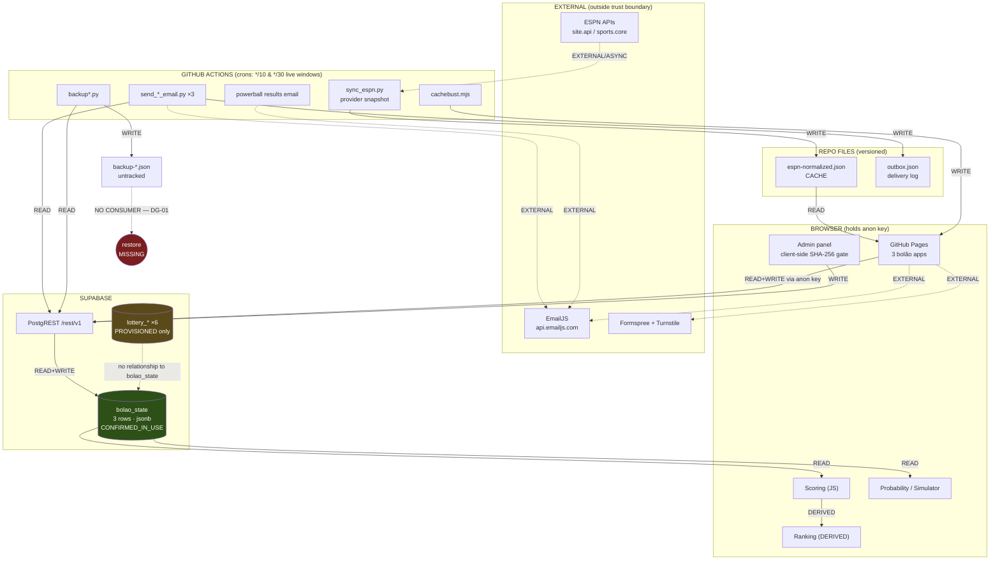
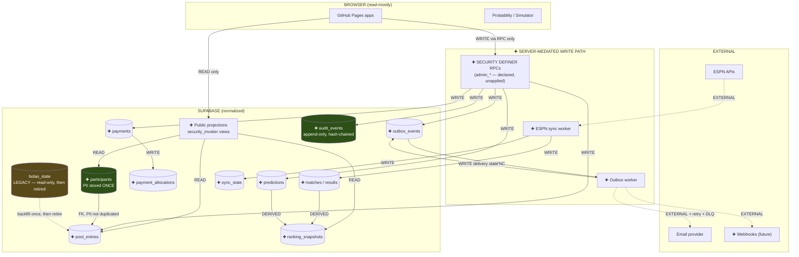

# DEPENDENCY_GRAPH — current and target data-flow topology

**STATUS:** COMPLETE for current state; target state is a *proposal*, not a decision.
**EVIDENCE BASIS:** 7 GitHub workflows in `.github/workflows/`; 11 Supabase-touching scripts;
transport confirmed REST-only (`rest/v1`, `https://<KNOWN_PROJECT_REF>.supabase.co`) with **no**
direct PostgreSQL driver anywhere (`psycopg2`/`asyncpg`/node-`pg` all absent); external hosts
enumerated from source; Phase 1/1B catalog evidence for the database side.
**KNOWN GAPS:** runner→Pages deployment relationships beyond `deploy-pages.yml` and
`sync_version.yml` are not asserted. Actual delivery success rates are unmeasured (no telemetry).
**ASSUMPTIONS:** none about deployment; every edge below traces to a file.

> **Correction (same session):** an earlier draft of this document asserted that scheduler cadence
> was UNKNOWN because no `cron:` line could be extracted. That was a **grep defect on my side** —
> the pattern required `cron:` immediately after whitespace and the workflows use YAML list syntax
> (`    - cron:`). All schedules are in fact fully specified and commented. §2.1 now reports the
> real cadences, and the false "cadence UNKNOWN" finding (formerly D-02, now DG-02′) is withdrawn and replaced
> by DG-02′ below, which is a genuine finding the correct reading exposed.

> Cross-references: `JSON_CLASSIFICATION.md` (what flows through `bolao_state`),
> `RLS_ASSUMPTIONS_REVIEW.md` §4 (which principal traverses which edge),
> `DATABASE_RECONCILIATION.md` (which target nodes do not yet exist).

---

> **Finding-ID namespace.** Findings in this document use the **`DG-`** prefix. An earlier revision
> used bare `D-0x`, which collided with the `D-0x` *decision* identifiers in
> `ARCHITECTURE_DECISION_REVIEW.md` — two different meanings for `D-01` (now `DG-` here, `DEC-` there). Renamed for
> unambiguous citation.

## 1. Edge semantics

| Edge | Meaning |
|---|---|
| **READ** | Consumer reads state it does not own |
| **WRITE** | Producer mutates persistent state |
| **DERIVED** | Computed from other nodes; no independent source of truth |
| **ASYNC** | Crosses a scheduler, queue, or manual trigger — not request-scoped |
| **EXTERNAL** | Leaves the trust boundary to a third party |

## 2. Nodes that exist vs. nodes that do not

| Node | Exists? | Evidence |
|---|---|---|
| GitHub Pages frontend | ✅ | `deploy-pages.yml`; 3 apps under `bolao/` |
| Supabase REST (PostgREST) | ✅ | `rest/v1` in 25 call sites |
| `bolao_state` | ✅ CONFIRMED_IN_USE | Phase 1B: 17 829 seq scans, 532 updates |
| Normalized lottery tables | ✅ but PROVISIONED only | Phase 1B classification |
| Competition modules (copa/br/cdb) | ✅ | 3 × `js/app.js`, `js/data.js` |
| Scoring | ✅ | `audit_scoring.py` × 4, per-app (intentionally separate) |
| Ranking | ✅ **DERIVED, not stored** | computed in `app.js`; no ranking table |
| Admin | ✅ client-side only | `guardAdmin()`, SHA-256 hash in `config.js` |
| ESPN sync | ✅ | `sync_espn.py` (br/cdb), `bolao_provider_snapshot.yml` |
| Email | ✅ | EmailJS (browser) + `send_*_email.py` (runner) |
| Outbox | ⚠️ **as a Git-tracked JSON file** | `powerball/scripts/email/outbox.json` |
| Scheduler | ✅ GitHub Actions, cadence fully specified | 7 workflows, 13 `cron` entries — see §2.1 |
| Payment handling | ⚠️ **`paid` boolean only** | `JSON_CLASSIFICATION.md` J-03 |
| Backup | ✅ **untracked JSON files** | `bolao/backups/backup-*.json`, `backup*.py` |
| Restore | ❌ **no restore path found** | no script consumes `backup-*.json` |
| Audit | ⚠️ two partial impls | `auditLog` (capped 200) + `lottery_admin_audit` (unenforced) |
| Imports / Exports / CSV | ⚠️ partial | `add_participants.py`, `new_participants_template.csv`, PDF/receipt generation |
| Reporting | ❌ does not exist | no cross-competition query surface |
| Simulator / Probability | ✅ client-side | live probability bars, BR2026 projection model |

**Finding DG-01 — HIGH.** **There is no restore path.** Backups are produced (`backup_daily.py`,
`backup.py`, `backup_watch_m88.py`) and never consumed. A backup that has never been read is an
untested assertion. This directly gates `RESTORE_REHEARSAL_READINESS`.

### 2.1 Actual scheduler cadence (all triggers, from source)

| Workflow | Trigger | Window (UTC) | Status |
|---|---|---|---|
| `cdb2026_result_emails.yml` | `*/10` | 16–23 and 00–05, **daily** | **ACTIVE** — the live competition |
| `br2026_round_emails.yml` | `*/30` | 21–23 and 00–04, daily | ACTIVE |
| `powerball-results-email.yml` | `*/10` | Mon/Wed/Sat 22–23 + Tue/Thu/Sun 00–06 | ACTIVE |
| `auto_results.yml` (copa2026) | `*/10` | 16–23 and 00–05, **months 6–7 only** | **DORMANT** — see DG-02′ |
| `bolao_provider_snapshot.yml` | `workflow_dispatch` **only** | — | **MANUAL ONLY** — see DG-04 |
| `deploy-pages.yml` | push to `main` | — | ACTIVE |
| `sync_version.yml` | push to `main`, path-filtered | — | ACTIVE |

**Finding DG-02′ — LOW (dead schedule).** `auto_results.yml` carries a month filter `* 6-7 *`, so it
can only fire in June and July. Copa 2026 concluded 2026-07-19 and is archived, so the restriction
is *consistent* with reality — but the workflow is now permanently dormant and is unreachable dead
weight in CI. Classify **LEGACY**, retire deliberately rather than leaving a workflow that appears
active and cannot fire. (Recorded in `TECHNICAL_DEBT_REPORT.md`.)

**Finding DG-04 — MEDIUM (unbounded cache staleness).** `bolao_provider_snapshot.yml` has **no
`schedule:` trigger at all** — only `workflow_dispatch`. The in-repo comment states this is
deliberate ("enabling a real `schedule:` trigger is a deliberate, separate, reviewed step"). The
consequence is that `espn-normalized.json`, which the browser now reads *instead of* calling ESPN,
is refreshed **only when a human clicks the button**. Cache staleness is therefore unbounded and
unmonitored, while the result-email crons run every 10 minutes against live ESPN data. Two
different freshness regimes feed one user-visible surface. This is the finding the corrected reading
exposed, and it matters more than the false one it replaces.

**Finding DG-05 — MEDIUM (latent cron defect class, one already realised).**
`powerball-results-email.yml` contains an in-file record of a real defect fixed 2026-08-06: the
schedule previously covered Tuesday and Saturday only, omitting Monday and Wednesday, so it
**silently never fired after any Monday or Wednesday drawing**, including 2026-08-05. The bug was
invisible because a cron that does not fire produces no failure signal. Six hand-written cron windows
with UTC↔EDT offset arithmetic remain, and nothing tests them. This is precisely what
`OBSERVABILITY_MODEL.md` "expected-run heartbeat" addresses.

**Finding DG-03 — MEDIUM.** The outbox is a **Git-tracked JSON file** containing real recipient
addresses. It is simultaneously the delivery log, the queue, and a versioned artefact — three roles
that must not share one file. See `OBSERVABILITY_MODEL.md` (outbox depth) and Task 9 when authored.

---

## 3. CURRENT_STATE

### 3.1 What the current graph reveals

1. **The browser is a first-class writer to production.** `FE → REST → bolao_state` is a WRITE edge
   held open by an anon key that is also hardcoded in two tracked scripts
   (`HARDCODED_ANON_JWT = OPEN`). No server mediates it. Combined with
   `RLS_ASSUMPTIONS_REVIEW.md` §2.2 (no identity-based policy), the write path has **no
   server-side authorization anywhere on it**.
2. **Admin is a client-side concept.** The SHA-256 gate lives in `config.js` and runs in the
   browser; the database sees the same `anon` principal for admin and non-admin writes. There is no
   admin *boundary*, only an admin *UI*.
3. **Ranking is correctly derived** and never stored. This is right, and the target model must not
   regress it into a stored leaderboard — only into explicitly-labelled snapshots.
4. **The two database models never touch.** `lottery_*` and `bolao_state` share no edge. Two
   disjoint systems in one schema.
5. **Every external dependency is fire-and-forget.** ESPN, EmailJS, Formspree — no retry, no
   idempotency key, no dead-letter on any of them. Email is sent from *two* places (browser via
   EmailJS, runner via `send_*_email.py`) with no shared delivery ledger.

---

## 4. TARGET_STATE (proposal — not a decision)

Gated on `DATABASE_RECONCILIATION.md` R-03. Nodes marked ✚ do not exist yet.

### 4.1 The five structural changes the target encodes

| # | Change | Closes |
|---|---|---|
| 1 | Browser loses all WRITE edges; writes go through RPCs | No server-side authorization on the money path |
| 2 | Public reads go through `security_invoker` views, not table grants | `anon` holding table-level DML (`RLS_ASSUMPTIONS_REVIEW.md` O-1, O-2) |
| 3 | `participants` becomes the single PII holder; entries FK to it | PII duplicated per entry per competition (`JSON_CLASSIFICATION.md` §3) |
| 4 | Outbox becomes a table with a worker, retry and DLQ | DG-03, fire-and-forget email, dual send paths |
| 5 | `audit_events` append-only and uncapped | J-04 (200-cap) and R-04 (unenforced chain) |

**Deliberately unchanged in the target:** ranking stays DERIVED; ESPN snapshot stays a CACHE;
scoring stays per-competition (never generalised — repo governance forbids it).

---

## 5. RISKS

- Introducing RPCs while the browser still holds table grants yields **two** write paths, the weaker
  of which still bypasses every new control. Grants must be revoked in the same change that
  introduces the RPC path, or the mediation is cosmetic.
- `bolao_state` must stay readable throughout migration; retiring it early breaks three live apps.
- The outbox worker needs a runtime. GitHub Actions can host it (crons already run every 10 min
  in live windows), but Actions gives at-least-once, jitter-prone execution with no in-run queue
  visibility — so idempotency keys are mandatory, not optional.

## 6. NEXT DECISION (operator)

1. **Decide whether `bolao_provider_snapshot` gets a real `schedule:`** (DG-04). Today the ESPN
   cache refreshes only by hand while emails run every 10 minutes. This is an operator call because
   the repo comment says the manual-only state is deliberate.
2. **Choose the write-mediation runtime**: Supabase RPC (`SECURITY DEFINER`), Edge Function, or
   GitHub Actions worker. Determines the whole target write path.
3. **Accept or reject "browser never writes"** as an architectural invariant. Everything in §4
   follows from it; rejecting it means the authorization gap is accepted permanently.
