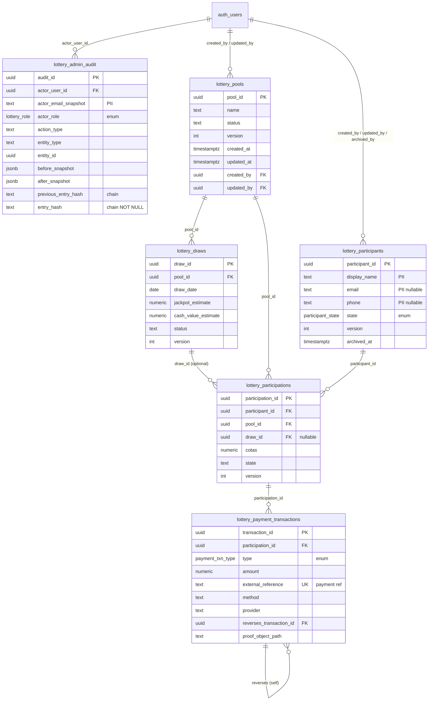
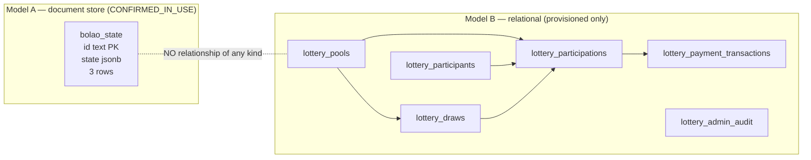

# LOGICAL DATA MODEL — AS-IS (reverse-engineered from the live catalog)

**Status:** COMPLETE for `public`. **Basis:** Phase 1 `S03`/`S04`/`S05`/`S06` + Phase 1B type
recovery. **Not** derived from repository DDL — see `DATABASE_RECONCILIATION.md` for why the repo
is not a reliable source for this.

> **Relationship to `PHASE0_DATA_MODELS.md`:** that document models the *repository's declared*
> intent (Phase 0, frozen). This document models *what production actually contains*. Where they
> disagree, production is authoritative for as-is purposes and the divergence is catalogued in
> `DATABASE_RECONCILIATION.md`. Phase 0 was not re-reviewed to produce this.

---

## 1. Two disjoint models in one schema

`public` contains **two unrelated data models** with **zero referential connection** between
them:

| Model | Objects | Paradigm | Status |
|---|---|---|---|
| **A — Bolão state** | `bolao_state` | Single-table document store (`jsonb` blob keyed by app) | CONFIRMED_IN_USE |
| **B — Lottery/Powerball** | 6 `lottery_*` tables | Normalised relational, 3NF-leaning, audited | Provisioned, seeded, not production-bearing |

They share no foreign key, no naming convention, and no lifecycle. Any target design must treat
them as separate bounded contexts that happen to be co-located. Model A is the money-bearing one
today; Model B is the architecturally mature one.

---

## 2. Model A — `bolao_state`

### Structure

| Col | Name | Type | Nullability | Default |
|---|---|---|---|---|
| 1 | `id` | `text` | NOT NULL | — |
| 2 | `state` | `jsonb` | NOT NULL | literal |
| 3 | `updated_at` | `timestamptz` | NOT NULL | `now()` |

- **Primary key:** `(id)` — `bolao_state_pkey`
- **Alternate keys:** none
- **Foreign keys:** none, in either direction
- **Indexes:** PK only. No expression, partial, or GIN index on `state`.
- **Row count:** 3 live (planner estimate; one row per app — copa2026 / br2026 / cdb2026)

### Key analysis

| Key type | Finding |
|---|---|
| **Natural key** | `id` *is* the natural key — a human-authored application slug, not a surrogate. |
| **Surrogate key** | None. Deliberate and, at 3 rows, defensible. |
| **Candidate PK** | `(id)` is the only candidate. Correct as chosen. |
| **Candidate alternate key** | None exists or is needed. |

### Structural observations

1. **No `GIN` index on `state`.** Acceptable only because the access pattern is
   "fetch entire row by `id`" — confirmed by evidence: 856 PK index scans and 17 829 sequential
   scans on a 3-row table, where seq scan is genuinely cheaper. This is *correct* for 3 rows and
   becomes wrong the moment a fourth access pattern appears.
2. **`updated_at` has no update trigger.** `DEFAULT now()` fires on INSERT only. With 532 updates
   and 3 inserts recorded, `updated_at` is only correct if every writer sets it explicitly.
   Nothing in the database enforces that. **Latent correctness risk** — the column looks
   authoritative and may be stale.
3. **No optimistic-concurrency column.** Model B uses `version integer` on 4 of 6 tables;
   Model A has none. With last-write-wins on a whole-document `jsonb` update from browser
   clients, two concurrent app writers silently lose one another's changes. The application
   mitigates by merge strategy (documented in `CLAUDE.md`), i.e. **the invariant is enforced in
   JavaScript, not in the database.**
4. **`state` is unconstrained `jsonb`.** No `CHECK`, no schema validation. Any shape is
   accepted, including one the app cannot parse.

---

## 3. Model B — lottery domain

### 3.1 Entities and cardinalities

| Entity | PK (surrogate) | Natural key candidate | Version col |
|---|---|---|---|
| `lottery_pools` | `pool_id uuid` | `name` (not enforced unique) | ✅ `version` |
| `lottery_draws` | `draw_id uuid` | `(pool_id, draw_date)` (not enforced) | ✅ `version` |
| `lottery_participants` | `participant_id uuid` | `email` (nullable, not unique) | ✅ `version` |
| `lottery_participations` | `participation_id uuid` | `(participant_id, pool_id, draw_id)` (not enforced) | ✅ `version` |
| `lottery_payment_transactions` | `transaction_id uuid` | `external_reference` (**unique index exists**) | ❌ none |
| `lottery_admin_audit` | `audit_id uuid` | `entry_hash` (chain position) | ❌ none (append-only by intent) |

Every PK is a `uuid` surrogate defaulted from a UUID function. Consistent and correct.

### 3.2 Relationships (all 17 FKs, all `ON DELETE NO ACTION`)

| Child | Column(s) | → Parent | Cardinality | Optional? |
|---|---|---|---|---|
| `lottery_draws` | `pool_id` | `lottery_pools(pool_id)` | many:1 | mandatory (NOT NULL) |
| `lottery_participations` | `participant_id` | `lottery_participants` | many:1 | mandatory |
| `lottery_participations` | `pool_id` | `lottery_pools` | many:1 | mandatory |
| `lottery_participations` | `draw_id` | `lottery_draws` | many:1 | **optional (nullable)** |
| `lottery_payment_transactions` | `participation_id` | `lottery_participations` | many:1 | mandatory |
| `lottery_payment_transactions` | `reverses_transaction_id` | **itself** | many:1 self-ref | optional |
| `lottery_admin_audit` | `actor_user_id` | `auth.users(id)` | many:1 | optional |
| 10 × `created_by` / `updated_by` / `archived_by` | | `auth.users(id)` | many:1 | optional |

### 3.3 ER diagram — Model B as it exists

### 3.4 Model A alongside Model B — the disconnection, drawn

---

## 4. Expected vs. actual constraints

### 4.1 Constraints that exist

- 7 primary keys, all present and correctly chosen.
- 17 foreign keys — full referential closure for Model B. No orphanable child.
- 1 unique index: `lottery_payment_transactions_external_reference_uidx`. **This is the single
  most valuable constraint in the schema** — it makes double-recording a payment reference
  impossible at the database level, and evidence shows it firing (11 probes / 11 inserts). It
  directly implements the Powerball txId governance rule.
- 3 enum types constraining `participant_state`, `payment_txn_type`, `actor_role`.
- `NOT NULL` applied to every identity, timestamp, and monetary column.

### 4.2 Expected constraints that are MISSING

Ranked by consequence. These are *findings*, not instructions — nothing is implemented here.

| # | Missing constraint | Where | Consequence |
|---|---|---|---|
| M-1 | Audit hash-chain triggers | `lottery_admin_audit` | `entry_hash` is `NOT NULL` with **nothing computing or validating it**; UPDATE/DELETE unblocked. The table advertises tamper-evidence it does not have. (`DATABASE_RECONCILIATION.md` R-04) |
| M-2 | `CHECK (amount > 0)` or explicit sign convention | `lottery_payment_transactions.amount` | A reversal is modelled by `type` + `reverses_transaction_id`, so sign semantics are ambiguous. Nothing prevents a negative payment or a zero-amount transaction. |
| M-3 | `UNIQUE (participant_id, pool_id, draw_id)` | `lottery_participations` | Same participant can be enrolled twice in the same draw. With `cotas` (shares) this silently double-counts entitlement — a **money-affecting** duplicate. ⚠️ **Scope note (added after operator ratification E1):** this recommendation applies **only to the as-is `lottery_participations` table**, where duplicates are accidental. It is **superseded in the target model**, where *multiple entries per participant per pool is a ratified requirement* — see `TARGET_DATA_MODEL.md` §3.3, which replaces uniqueness with a mandatory `entry_label`. Do not carry M-3 forward into `pool_entries`. |
| M-4 | `CHECK (reverses_transaction_id <> transaction_id)` | `lottery_payment_transactions` | A transaction may reverse itself. |
| M-5 | `UNIQUE (pool_id, draw_id)` on draws | `lottery_draws` | Two draws for the same pool and date. |
| M-6 | `UNIQUE (lower(email))` where non-null | `lottery_participants` | Duplicate participants by email; also weakens dedup during any future backfill. |
| M-7 | `CHECK (cotas > 0)` | `lottery_participations` | Zero/negative shares accepted. |
| M-8 | `status` / `state` domain constraints on `lottery_pools.status`, `lottery_draws.status`, `lottery_participations.state` | 3 tables | These are free `text` while three *other* status-like columns use enums. Inconsistent: the schema knows how to constrain enums and chose not to here. |
| M-9 | `updated_at` maintenance trigger | all 6 + `bolao_state` | `version` and `updated_at` are application-maintained. No database enforcement. |
| M-10 | FK `entity_id` → target | `lottery_admin_audit` | Polymorphic reference (`entity_type` + `entity_id`) is unenforceable by FK. Acceptable pattern, but the audit row can point at a nonexistent entity. |

### 4.3 Expected indexes that are missing

Currently **8 indexes for 7 tables** — 7 PKs + 1 unique. Every FK column is unindexed.

| Missing index | Why it will be needed |
|---|---|
| `lottery_participations(participant_id)`, `(pool_id)`, `(draw_id)` | Unindexed FKs. Parent deletes and all join paths degrade to sequential scans; also causes lock escalation on parent updates. |
| `lottery_draws(pool_id)` | Unindexed FK; "draws in a pool" is the primary query. |
| `lottery_payment_transactions(participation_id)` | Unindexed FK; "payments for a participation" is the reconciliation query. |
| `lottery_admin_audit(entity_type, entity_id)` | The audit-lookup access path; currently only reachable by full scan. |
| `lottery_admin_audit(server_created_at)` | Chronological audit reads; full scan today. |

At current volumes (1–11 rows) none of this matters. All of it matters before the first real
draw. Recording it now is the point.

---

## 5. Design observations carried to the target model

1. **Model B is a good relational design that was never finished.** Surrogate PKs, full FK
   closure, enum-typed states, optimistic-locking columns, an audit table with hash-chain intent,
   and a unique payment reference. The *missing* pieces are enforcement (M-1) and access paths
   (§4.3), not structure. **Recommendation: extend Model B, do not redesign it.**
2. **Model A is a document store pretending to be a table.** It is correct at 3 rows and will not
   survive normalisation pressure. It is also the only part carrying real money today. Migrating
   it is the highest-risk item in the programme and must not be first.
3. **The audit table is the reference pattern for the target `audit` domain** — provided M-1 is
   closed. Its column set (actor snapshot, before/after, reason, `request_id`, `correlation_id`,
   `source`, `client_metadata`, hash chain) is genuinely well-designed and worth generalising.
4. **`auth.users` is already the identity anchor** — 11 of 17 FKs point at it. The target model
   should not invent a parallel user table.
5. **PII is concentrated and identifiable:** `lottery_participants.{display_name,email,phone}` and
   `lottery_admin_audit.actor_email_snapshot`. Four columns across two tables. This is a tractable
   PII surface — see `DATA_GOVERNANCE.md` when produced.

---

## 6. Evidence limitations

- Column **default expressions** were never read (structural flags + md5 only, per pack policy),
  so §4 infers defaults by flag, not text.
- Enum **label values** were not read. Whether applied labels match declared labels is
  **UNVERIFIED** and needs a directed review.
- `bolao_state.state` **internal shape was not read** (PII policy). Model A's document structure
  must be derived from application code, not the database — that is the job of
  `JSON_CLASSIFICATION.md`.
- `CHECK` constraint bodies were not read; §4.1 counts constraints by type only. Production
  reports **0 CHECK constraints** on these tables beyond `NOT NULL`, so §4.2 is not at risk of
  duplicating an existing check.
