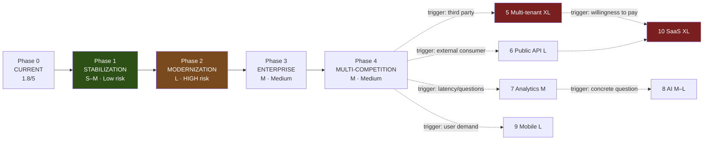

# ROADMAP_PHASED — Current → SaaS

**STATUS:** COMPLETE as a roadmap. **No phase authorized; no work started beyond Phase 1.**
**EVIDENCE BASIS:** every artefact in this directory. Effort is **ordinal** (S/M/L/XL), not calendar —
no team size, availability or budget was ever stated.
**KNOWN GAPS:** no cost figures exist (Supabase tier, egress, Edge Function invocations all unpriced
here); no user-growth projection; no revenue model. Cost columns are therefore *relative*.
**ASSUMPTIONS:** single maintainer; real money per pool; correctness outranks feature velocity.

> **A judgment stated upfront.** The requested ladder ends at *Multi-tenant → Public API → Analytics →
> AI → Mobile → SaaS*. For a private, invite-only pool among known individuals, **phases 5–10 are
> almost certainly the wrong destination**, and this roadmap says so rather than drawing an
> aspirational line. They are documented as *conditional* phases with explicit trigger conditions, so
> the decision to pursue them is deliberate rather than momentum. Phases 1–4 are unconditionally
> justified by evidence already collected.

> Cross-references: `AUDIT_READINESS.md` §3 (epics/backlog), `ARCHITECTURE_DECISION_REVIEW.md`
> (decisions), `TARGET_DATA_MODEL.md` (the model phases 2–3 build), `MODERNIZATION_BACKLOG.md`.

---

## Phase 0 — CURRENT (as measured, 2026-08-08)

| Dimension | State |
|---|---|
| Data | 7 tables, ~500 kB, `bolao_state` CONFIRMED_IN_USE (3 rows), 6 lottery tables provisioned-not-bearing |
| Reproducibility | Baseline captured; **not yet a CLI migration** — R-03 `MATERIALLY_ADVANCED` |
| Recoverability | First logical backup taken and verified; **no restore ever exercised** |
| Security | `anon` TRUNCATE revoked; `anon` still holds DML; policies are row-allowlists, not authorization |
| Audit | Two partial implementations, neither enforcing |
| Observability | **None** — 0 metrics, 0 alerts, 0 dashboards |
| Tests | Strong app suite; **no CI enforcement**; 4 of 9 test classes absent |
| Readiness score | **1.8 / 5** (`AUDIT_READINESS.md`) |

---

## Phase 1 — STABILIZATION

**Goal: make the current system provable. No new capability.**

| Benefits | Risks | Dependencies | Cost | Complexity | Rollback |
|---|---|---|---|---|---|
| Schema reproducible from VCS; restore proven; tests enforced; ACL drift detected; audit stops losing history | Low throughout — mostly capture, documentation and repo-side work | Operator decisions only (CLI install, literal policy, T3) | **S–M** | **Low** | Every item individually revertible; no data migration |

Contents: install Supabase CLI → `db pull` baseline adoption (closes R-03) · write the restore path and
run the rehearsal (A1–A11) · encrypt the ~545 MB of legacy plaintext artefacts · fix assertion 13 and
add a CI test job · fix H-00 so the PII gate works · remove the `auditLog` 200-cap · ACL drift monitor ·
`ANALYZE` + the 6 FK indexes.

**This phase is unconditionally justified.** Every item traces to a measured finding, none needs a data
migration, and it moves 5 of 12 scorecard domains off a 1–2.

**Exit criteria:** R-03 closed · one successful documented restore · CI green and enforcing · readiness ≥ 3.0.

---

## Phase 2 — MODERNIZATION (the target data model)

**Goal: `participants` becomes real; money becomes reconcilable.**

| Benefits | Risks | Dependencies | Cost | Complexity | Rollback |
|---|---|---|---|---|---|
| Cross-competition reporting; PII stored once; settlement derived not flagged; append-only audit; outbox with delivery guarantees | **HIGH** — touches the live money path; half-migrated state where neither side is authoritative is the worst outcome available | Phase 1 complete; R-03 closed; G-02 decided **before** `audit_events` is built | **L** | **High** | Dual-write + read-switch is reversible **only while the JSON path is still written**. Point of no return = retiring `bolao_state`. |

Sequence (re-sequenced per DEC-16 — the prompt's original order was unsafe): server-mediated writes
first (Edge Functions, E3) → dual write → backfill → continuous reconciliation with a zero-divergence
gate → read switch → cleanup. `predictions` **last**, with a scoring parity proof against all four
`audit_scoring.py` suites.

**Hard prerequisite:** dual write from three independent browser apps cannot be atomic. **DEC-11 is not a
parallel workstream; it is a gate.**

**Exit criteria:** zero divergence for a full competition cycle · scoring parity proven · `bolao_state`
read-only.

---

## Phase 3 — ENTERPRISE (controls and operations)

**Goal: pass an external audit without heroics.**

| Benefits | Risks | Dependencies | Cost | Complexity | Rollback |
|---|---|---|---|---|---|
| Enforced retention/erasure; hash-chained audit verified continuously; SLOs with error budgets; DR rehearsed on a schedule; least-privilege ACLs | Medium — mostly additive; the risk is **process** cost exceeding value for a single maintainer | Phase 2 (needs the normalized model) | **M** | Medium | Controls can be relaxed; data changes are minimal |

Contents: retention + redaction jobs (G-01/G-02) · `FORCE RLS` once no app path connects as owner ·
dedicated app owner role · full observability (O-01…O-33) · privacy notice · quarterly DR rehearsal ·
`prize_allocations` reconciliation.

**Exit criteria:** readiness ≥ 4.0 on security/backup/traceability/recoverability/RLS.

---

## Phase 4 — MULTI-COMPETITION SCALE *(not multi-tenant)*

**Goal: adding a 2027 competition is configuration, not a code fork.**

| Benefits | Risks | Dependencies | Cost | Complexity | Rollback |
|---|---|---|---|---|---|
| New editions without a new `app.js`; shared merge/audit primitives (DEC-01(a)); year-over-year reporting real | Medium — the temptation to generalise tournament *rules* must be resisted (repo governance forbids it, DEC-09 rejects it) | Phase 2 | **M** | Medium | Per-competition code can be re-forked if the abstraction fails |

**Explicitly bounded:** `competitions`/`competition_editions`/`phases` carry identity and schedule
**only**. Scoring stays per-competition, forever.

**This is the last phase I would recommend without a new business reason.** Everything below requires a
trigger that does not currently exist.

---

## Phases 5–10 — CONDITIONAL. Each has a trigger; none is currently met.

| Phase | Trigger that would justify it | If pursued: benefit / risk | Cost | Complexity |
|---|---|---|---|---|
| **5 · Multi-tenant** | A *third party* wants to run their own pools on this platform | Isolation per tenant / **RLS-based tenancy on a system whose RLS is currently row-allowlists is a serious undertaking**; a tenancy bug is a cross-customer data breach | **XL** | **Very high** |
| **6 · Public API** | An external consumer exists and is committed | Integration surface / **PostgREST already exposes tables — a "public API" today would formalise the current over-exposure**. Needs `bolao_api` (E1) first, versioning, rate limits, auth, deprecation policy | **L** | High |
| **7 · Analytics / OLAP** | Questions that the normalized model cannot answer within acceptable latency | Historical insight / **premature at ~500 kB.** `ranking_snapshots` + a few materialized views cover realistic needs for years | **M** | Medium |
| **8 · AI workloads** | A concrete question worth answering probabilistically that the existing projection model cannot | Prediction quality / **highest risk of building something impressive and useless.** Note: the BR2026 projection model already exists and is documented as *informative* — extending it is cheaper than an AI phase | **M–L** | Medium |
| **9 · Mobile** | Participants report the responsive web app is insufficient | Native UX / **the site is already mobile-first and responsive** (`DESIGN_SYSTEM.md`); a native app adds two build pipelines, two stores, and a release cadence for a seasonal product | **L** | High |
| **10 · SaaS** | Willingness to pay from someone who is not the operator | Revenue / requires 5+6 plus billing, support, SLAs, ToS, and becoming a data processor under GDPR/LGPD rather than a controller of one's own pool | **XL** | Very high |

### Why the conditional framing is the honest answer
The system serves a **private, invite-only pool of known individuals**, holds **~500 kB**, is
maintained by **one person**, and currently scores **1.8/5** on basic controls. Building
multi-tenancy or a public API on that foundation would add attack surface and operational burden to a
system that cannot yet prove it can be restored. **Sequencing matters more than ambition:** phases 1–3
raise readiness from 1.8 to ~4.0; phases 5–10 would each *lower* it again until re-hardened.

---

## Dependency graph

Solid arrows = justified by evidence. Dotted = conditional on a trigger not currently met.

## Rollback posture per phase

| Phase | Reversible? | Point of no return |
|---|---|---|
| 1 | **Fully** | none |
| 2 | While the JSON path is still written | **Retiring `bolao_state`** |
| 3 | Controls relaxable | none material |
| 4 | Code re-forkable | none material |
| 5 | **Effectively not** | Tenant data commingled under one schema |
| 6 | Only with a deprecation window | First external consumer depends on it |
| 7–9 | Yes (additive) | none |
| 10 | **No** | First paying customer |

## RISKS of the roadmap itself

- **Phase 2 is where a real incident could occur.** Everything before it is capture and proof;
  everything after depends on it. If only one phase gets proper review time, it is this one.
- **Phase-1 fatigue is the likely failure mode.** It is unglamorous — capture, encrypt, enforce, verify
  — and skipping to Phase 2 is tempting. Doing so means migrating a system that cannot be restored.
- **Conditional phases will be requested before their triggers are met.** The triggers are written down
  precisely so that conversation can reference evidence rather than appetite.

## NEXT DECISION (operator)

1. **Accept phases 1–4 as the committed roadmap and 5–10 as conditional?**
2. **Authorize Phase 1 as a block** (all items are low-risk and individually revertible).
3. Confirm the Phase-2 point of no return (retiring `bolao_state`) requires its own explicit sign-off.
