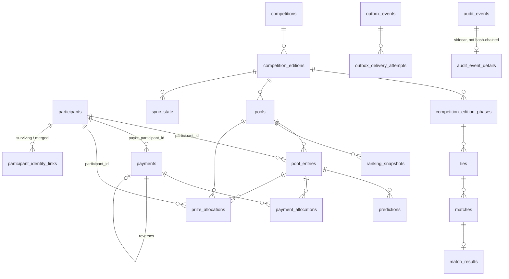

# TARGET_DATA_MODEL — refined normalized design (no executable DDL)

**STATUS:** DESIGN REFINEMENT. **No DDL generated. Nothing implemented.**
**EVIDENCE BASIS:** operator-ratified A3/B1/E1/E3; DR-1 policy semantics
(`RLS_ASSUMPTIONS_REVIEW.md` §6a); `LOGICAL_DATA_MODEL_ASIS.md`; `JSON_CLASSIFICATION.md`;
`ARCHITECTURE_DECISION_REVIEW.md` DEC-06…DEC-16; `NAMING_STANDARDS.md`;
`DDL_BASELINE_AND_R03_RESOLUTION.md`.
**KNOWN GAPS:** the *fee model* is now ratified (§3.4a) but **actual fee values per pool are not
known** and must be supplied before backfill; whether `payerName ≠ entryName` is a product rule or an
accident is still unconfirmed (though the model now supports it either way); enum label parity
unverified; no growth projection exists; prize-payout recording practice unverified against
`prize_allocations`.
**ASSUMPTIONS:** `auth.users` remains the operator-identity anchor; participants generally do **not**
authenticate.

---

## 1. Ratified constraints this design must satisfy

| Ratified | Consequence for the model |
|---|---|
| **A3** — `supabase/migrations/` becomes source of truth | Every object below must be expressible as an ordered migration from the captured baseline. Legacy SQL is forensic only. |
| **B1** — audit must not carry unnecessary raw PII | `audit_events` stores **IDs, actions, timestamps, correlation IDs and safe structured metadata** — not names, emails, phones, raw payment references or large payloads. Sensitive detail, where genuinely required, is separated with independent access/retention. |
| **E1** — `pool_entries`; dedicated schema | `participation` is retired. Internal tables live in a non-exposed schema; the API surface is explicit (views/RPC). |
| **E3** — Edge Functions as the write boundary | No table in the exposed contract may accept direct browser DML. Multi-table writes happen inside a transactional function. |

**DR-1's contribution:** because no existing policy is identity-aware, the target RLS model is a
**replacement, not a refinement** — nothing is lost by redesigning authorization from scratch.

---

## 2. Schema topology (E1)

| Schema | Exposure | Contents |
|---|---|---|
| `bolao` | **NOT** in the PostgREST contract | All base tables. Internal. |
| `bolao_api` | **Exposed** | `security_invoker` views + RPCs. The only public surface. |
| `audit` | **NOT** exposed | `audit_events`, retention-controlled sensitive-detail sidecar |
| `public` | legacy, shrinking | `bolao_state` + `lottery_*` during migration, then retired |

**Why this matters concretely:** today every table in `public` is directly addressable by a browser
key because PostgREST exposes `public` and `PUBLIC` holds `USAGE` on it. Moving base tables out of
`public` removes that reachability **structurally**, rather than relying on RLS to compensate for it.
This is the single highest-value structural change in the design.

## 3. Entity design

### 3.1 Identity

**`participants`** — the keystone. PII stored **exactly once** in the system.
Keys: `participant_id uuid` PK. Natural key candidate: normalised email, `UNIQUE` **partial** where
non-null (email is nullable and must remain so). Attributes: `display_name`, `email`, `phone`
(*retain only if a purpose is confirmed — `DATA_GOVERNANCE.md` NEXT DECISION 2*), `state`, `version`,
timestamps, `redacted_at` / `redaction_reason` to support erasure-by-redaction (G-02).

**`participant_identity_links`** — makes consolidation **reversible**, which DEC-07 requires because
over-merging money is unrecoverable.
Columns: `link_id`, `surviving_participant_id` FK, `merged_participant_id` FK, `merged_at`,
`merged_by` FK→`auth.users`, `confidence`, `reason`, `reverted_at`, `reverted_by`.
Rule: merges are **operator-confirmed only, never automatic**. Backfill begins with **zero** merges —
one participant per historical entry — and merges only on explicit confirmation. The merged record is
retained, never deleted, so a merge can be undone.

### 3.2 Competition structure

**`competitions`** (durable tournament) → **`competition_editions`** (one running) →
**`competition_edition_phases`** (per-phase `cutoff_at`, closing `JSON_CLASSIFICATION.md` J-05's
two-sources-of-cutoff problem by giving the deadline exactly one home).

**Hard boundary, restated:** these tables carry **identity, edition, phase and schedule only** — never
rules, scoring or advancement logic. Repo governance forbids generalising tournament logic, and DEC-09
rejects a generic rules engine. Tournament-specific structure stays per competition.

### 3.3 Pools and entries

**`pools`** — belongs to a `competition_edition`. Attributes: `name`, `status`, `prize_pool_split`,
`version`. **No `entry_price_amount` column** — fee lives in `pool_fee_schedule` (§3.4a) so that
historical re-pricing is representable. An earlier draft of this document put the price directly on
`pools`; that is **superseded** by the ratified fee model, because a single column cannot express a
fee change over time.

**`pool_entries`** — one competitive entry (E1).
Keys: `pool_entry_id` PK; FKs `participant_id`, `pool_id`.
**Deliberately NO unique constraint on `(participant_id, pool_id)`** — multiple entries per
participant per pool is a ratified requirement. Note this is the *opposite* of
`LOGICAL_DATA_MODEL_ASIS.md` M-3, which proposed a uniqueness constraint on the legacy
`lottery_participations`; that recommendation applied to the as-is table where duplicates were
accidental, and it is **superseded here** by the ratified requirement. Uniqueness moves to a
deliberate `entry_label` per `(participant_id, pool_id)` so multiple entries are distinguishable
rather than accidental.
Carries `entry_label`, `state`, `version`, `submitted_at`, timestamps, `created_by`.
**No PII** — `display_name`/`email` live only in `participants`.

### 3.4 Money

**`payments`** — a money movement as it actually happened.
`payment_id` PK; `payer_participant_id` FK→`participants` (**this is how `payer ≠ participant` is
expressed**); `amount`, `type` (enum, reuse `payment_txn_type` semantics), `method`, `provider`,
`external_reference` (**`UNIQUE` — carry the existing enforced index forward; it is the most valuable
constraint in the current schema**), `paid_at`, `reverses_payment_id` self-FK, `proof_object_path`.

**`payment_allocations`** — resolves the many-to-many.
`allocation_id` PK; `payment_id` FK; `pool_entry_id` FK; `allocated_amount`.
Invariants: `allocated_amount > 0`; `SUM(allocated_amount) per payment <= payments.amount`
(O-17). Equality is *not* required — partial allocation is legitimate and the residual is meaningful.
`UNIQUE (payment_id, pool_entry_id)` prevents double-allocating the same payment to one entry.

**`prize_allocations`** — **closes the reporting gap this review found.** Winnings were not answerable
under the original proposal.
`prize_allocation_id` PK; `pool_id` FK; `pool_entry_id` FK; `participant_id` FK (denormalised for
reporting); `rank`, `gross_amount`, `net_amount`, `awarded_at`, `paid_out_at`,
`payout_external_reference`, `payout_method`.
Separate from `payments` because prizes flow **outward**; conflating inbound and outbound money in one
table makes reconciliation ambiguous and is a classic accounting modelling error.

### 3.4a Entry fee and settlement — OPERATOR RATIFIED

Fee is a property of a **pool/rule**, never of a participant, and **no universal price is assumed.**

**`pool_fee_schedule`** — makes historical fee changes representable:
`pool_fee_schedule_id` PK; `pool_id` FK; `fee_amount numeric(14,2)`; `currency`;
`effective_from timestamptz`; `effective_to timestamptz NULL`; `reason`.
A pool may have several rows over time; at most one is current. This is what allows a pool to
re-price without corrupting history.

**`pool_entries.expected_fee_amount` — a mandatory SNAPSHOT, not a lookup.**
The applicable fee is copied onto the entry at creation (together with
`pool_fee_schedule_id` for provenance). This is the mechanism that keeps historical reporting
stable if pool pricing later changes: a 2026 entry keeps its 2026 fee even after a 2027 re-price.
Deriving the fee by joining to the *current* schedule row would silently rewrite history — the
single most important modelling decision in this section.

**Settlement is DERIVED, never a maintained boolean.** For a given entry:

```
allocated := COALESCE(SUM(payment_allocations.allocated_amount) WHERE pool_entry_id = e), 0)
expected  := pool_entries.expected_fee_amount
```

| Classification | Condition |
|---|---|
| `UNPAID` | `allocated = 0` |
| `PARTIALLY_PAID` | `0 < allocated < expected` |
| `SETTLED` | `allocated = expected` |
| `OVERPAID` | `allocated > expected` |

Exposed as a generated/derived column or an `bolao_api` view — **never** stored as a flag. This
directly replaces the `paid` boolean (J-03), which could express none of these four states.

**Supported cases, and the mechanism for each:**

| Case | Mechanism |
|---|---|
| Pool-specific fees | `pool_fee_schedule` per pool |
| Historical fee changes | `effective_from`/`effective_to` + entry-level snapshot |
| Multiple entries per participant per pool | no unique on `(participant_id, pool_id)`; `entry_label` distinguishes |
| Payer ≠ entry owner | `payments.payer_participant_id` independent of the entry's participant |
| One payment covering multiple entries | `payment_allocations` M:N |
| Partial payment | `allocated < expected` ⇒ `PARTIALLY_PAID` |
| Overpayment | `allocated > expected` ⇒ `OVERPAID`; residual visible, not silently absorbed |
| Cross-pool allocation | allocations reference `pool_entry_id`, so one payment may settle entries in **different pools** |
| Refund / reversal | `payments.reverses_payment_id` self-FK; a reversal carries negative-signed or typed allocations |

**Invariant revised.** Because overpayment is explicitly supported, the constraint
`SUM(allocated) <= payments.amount` still holds **per payment** (you cannot allocate more of a
payment than exists), but **no** constraint caps allocation against `expected_fee_amount` — that
is what makes `OVERPAID` representable rather than rejected. O-17 monitors the per-payment
invariant; the per-entry over-allocation is a *reportable state*, not an error.

**Prize flows stay separate.** `prize_allocations` (§3.4) models money flowing **outward** and is
never mixed into `payments`/`payment_allocations`. Conflating inbound and outbound money makes
reconciliation ambiguous.

### 3.5 Competition data and predictions

**`matches`** (a single fixture) · **`ties`** (a two-legged tie *containing* matches, with aggregate and
qualification rules — a tie is **not** a match) · **`match_results`** (authoritative outcome, separated
from participant scores per `NAMING_STANDARDS.md`) · **`predictions`** (one row per
`pool_entry` × predicted subject).

**`predictions` is deliberately LAST.** It touches scoring. Migration requires a parity proof against
all four `audit_scoring.py` suites before any read switch. Until then `picks` remains a JSONB column on
`pool_entries` (DEC-06 hybrid).

**`ranking_snapshots`** — point-in-time, explicitly derived. The `_snapshots` suffix is load-bearing:
ranking is currently correctly computed on demand and must not silently become a source of truth.
Carries `computed_at`, `scoring_rule_version` (preserving ADR-005), `is_provisional` (preserving
ADR-003's official-vs-provisional distinction).

### 3.6 Operational

**`sync_state`** — `espnSync` finally has a home. `(provider, competition_edition_id)` key,
`active_phase_id`, `cursor jsonb`, `last_success_at`, `last_error_at`, `seed_flags jsonb`. Feeds
O-02 (snapshot freshness) and DG-04 (manual-refresh staleness).

**`audit_events`** — append-only, **B1-compliant**.
Stores: `audit_event_id`, `occurred_at`, `actor_user_id` FK→`auth.users`, `actor_role`, `action`
(`aggregate.past_tense`), `aggregate_type`, `aggregate_id`, `correlation_id`, `request_id`, `source`,
`safe_metadata jsonb`, `previous_event_hash`, `event_hash`.
**Does NOT store:** participant names, emails, phones, raw payment references, secrets, or large raw
payloads. Where before/after detail is genuinely required it goes to a separate
`audit_event_details` sidecar with independent access control and its own shorter retention —
**and it is excluded from the hash chain**, so PII can be redacted without breaking integrity (G-02).
Enforcement: `BEFORE UPDATE`/`BEFORE DELETE` triggers that raise; `BEFORE INSERT` trigger computing
the chain. **This is what R-04 is missing today.**

**`outbox_events`** + **`outbox_delivery_attempts`** — split deliberately: the event is the intent, the
attempts are the history. One row per attempt gives failure forensics that a status column cannot.
`outbox_events`: `idempotency_key` **UNIQUE NOT NULL** (mandatory — GitHub Actions is at-least-once),
`channel`, `event_type`, `payload jsonb`, `status` (`pending|sent|failed|dead`), `attempt_count`,
`next_attempt_at`, `dead_at`. Feeds O-07…O-12.

## 4. Model



## 5. Requirement traceability

| Requirement | Satisfied by | Verified |
|---|---|---|
| One participant across many pools | `participants` 1:N `pool_entries` via `pool_id` | ✅ |
| Multiple entries per participant per pool | **no** unique on `(participant_id, pool_id)`; `entry_label` distinguishes | ✅ |
| `payer ≠ participant` | `payments.payer_participant_id` independent of the entry's participant | ✅ |
| One payment across multiple entries/pools | `payment_allocations` M:N | ✅ |
| Historical reporting | `competition_editions` + immutable entries | ✅ |
| Prize / winnings reporting | **`prize_allocations`** (gap closed) | ✅ |
| Reversible identity consolidation | `participant_identity_links` with `reverted_at` | ✅ |
| Auditability | `audit_events` hash-chained, append-only, B1-compliant | ✅ |
| PII not duplicated | PII only in `participants`; entries hold FKs | ✅ |
| Year-over-year participation | `competitions` → `competition_editions` | ✅ |

### 5.1 Reporting queries these enable
Participation history per person (join `participants`→`pool_entries`→`pools`→`competition_editions`);
pools entered count; total paid (sum `payment_allocations` by payer or by beneficiary — *both* now
answerable, which the boolean could not do); total won (`prize_allocations`); net position
(paid − won); performance across competitions; full audit trail by `correlation_id`.

## 6. Deliberately rejected

| Rejected | Reason |
|---|---|
| Generic tournament-rules engine | DEC-09; violates repo governance forbidding generalised tournament logic |
| Full event sourcing | DEC-14; 3 rows, ~500 KB, single maintainer, no replay requirement |
| A `users` table parallel to `auth.users` | 11 FKs already anchor there |
| `participations` naming | E1 |
| Storing `paid` as a boolean | J-03; derived from allocations instead |
| A `rankings` table without `_snapshots` | would become a de-facto source of truth |
| Automatic participant dedup | DEC-07; over-merge of money is unrecoverable |
| Base tables in `public` | E1; PostgREST exposure is the current structural defect |
| PII inside `audit_events` | B1 |

## 7. RISKS

- **`pool_entries` has no natural uniqueness by design.** This is ratified, but it removes a safety
  net: an accidental duplicate submission is now indistinguishable from an intentional second entry.
  `entry_label` must be **required**, not optional, or duplicates become unauditable.
- **`prize_allocations` is new and unvalidated against real prize history.** The 70/20/10 split is
  documented in config; whether historical payouts followed it is unverified.
- **Entry price is unknown**, so "settled" cannot yet be derived. This blocks the `paid` replacement.
- **The hybrid JSONB decision (`picks` stays JSON) could invert** if cross-entry prediction analytics
  becomes a requirement. Revisit before, not after, `predictions` migration.
- **Schema relocation out of `public` is a breaking API change** for anything reading tables directly.
  The `bolao_api` view layer must land first.

## 8. NEXT DECISION (operator)

1. **Entry price and allocation rules** — blocks deriving settled/unsettled.
2. **Is `payer ≠ participant` a product rule?** If accidental, `payment_allocations` may be simplified.
3. **Retain `phone`?** Data-minimisation call (`DATA_GOVERNANCE.md`).
4. **Confirm `prize_allocations` shape** against how payouts are actually recorded today.
5. **Approve `audit_event_details` as a hash-chain-excluded sidecar** — the mechanism that makes G-02
   erasure and audit integrity coexist.
