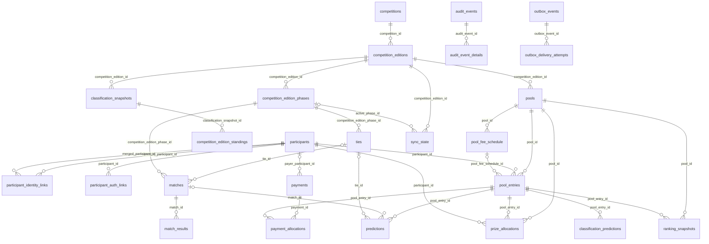
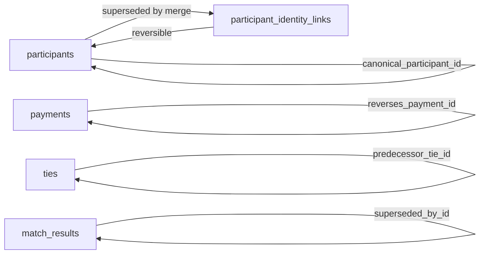
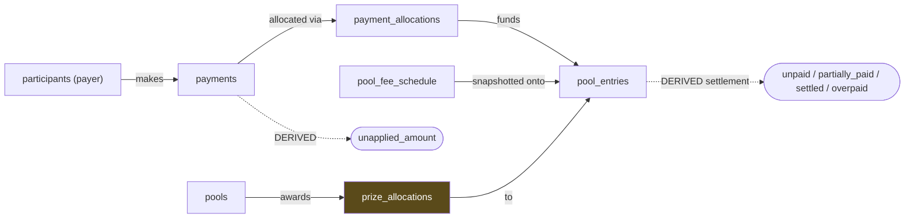
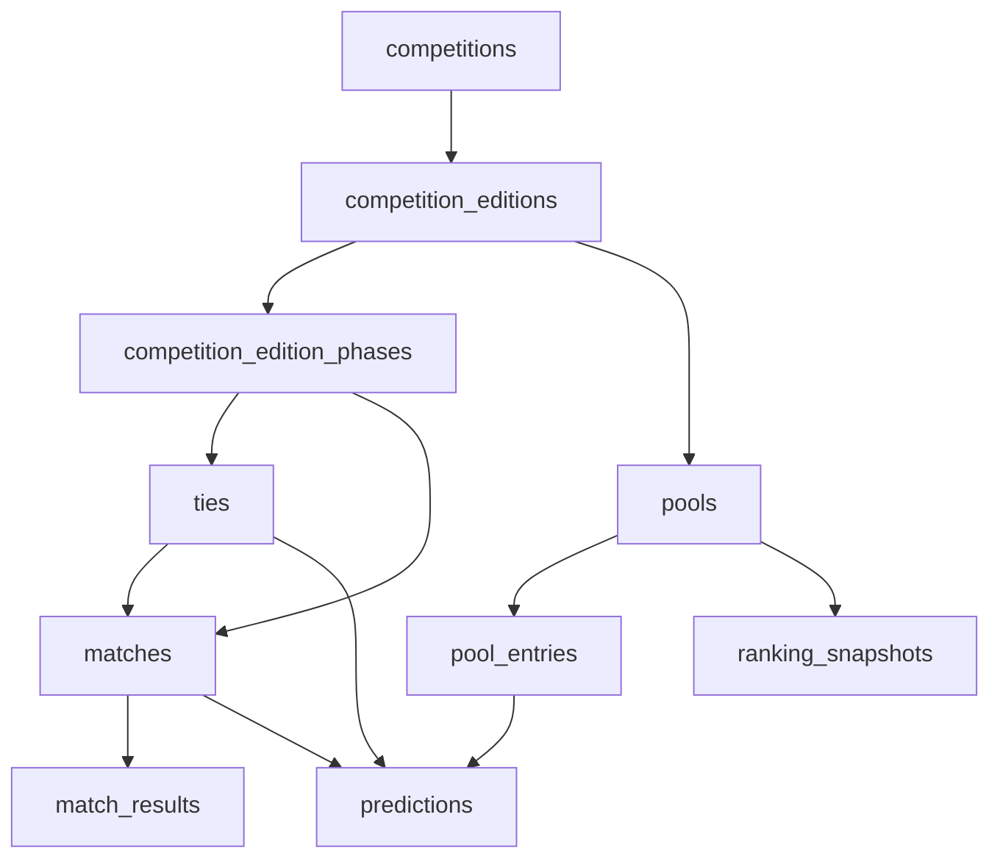
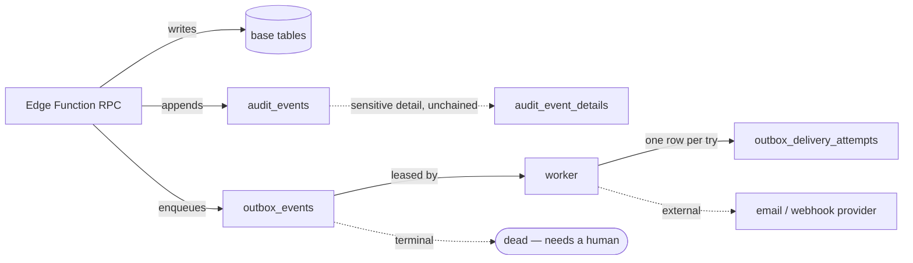

<!-- GENERATED FILE — DO NOT EDIT BY HAND.
     Source of truth: model/target_model.json
     Generator:       scripts/db/generate_model_docs.mjs
     Regenerate:      node scripts/db/generate_model_docs.mjs
     Any hand edit will be overwritten and will fail `--check` in CI.
     Workstream J — target ERD and migration dependency order -->

# TARGET_ERD — logical model, financial flow, and dependency ordering

Generated from the model, so the diagram cannot drift from the attribute grid.

---

## 1. Logical ERD — full target model

## 2. Self-references and identity graph

## 3. Financial flow — inbound and outbound kept separate

Inbound (`payments` → `payment_allocations`) and outbound (`prize_allocations`) never share a
table. Conflating them is the classic accounting modelling error that makes reconciliation
ambiguous.

## 4. Competition hierarchy

## 5. Outbox and audit flow

`audit_event_details` is deliberately OUTSIDE the hash chain: that is what lets PII be
redacted for an erasure request without breaking audit integrity (G-02).

## 6. Migration dependency order (topological)

Creation order that satisfies every FK. Derived from the model, not hand-sequenced.

| # | Entity | Phase | Depends on |
|---|---|---|---|
| 1 | `participants` | M2 | — |
| 2 | `participant_identity_links` | M2 | `participants` |
| 3 | `participant_auth_links` | M2 | `participants` |
| 4 | `competitions` | M3 | — |
| 5 | `competition_editions` | M3 | `competitions` |
| 6 | `competition_edition_phases` | M6 | `competition_editions` |
| 7 | `classification_snapshots` | DDL-M11 | `competition_editions` |
| 8 | `competition_edition_standings` | DDL-M11 | `classification_snapshots` |
| 9 | `pools` | M4 | `competition_editions` |
| 10 | `pool_fee_schedule` | M4 | `pools` |
| 11 | `pool_entries` | M4 | `pools`, `participants`, `pool_fee_schedule` |
| 12 | `payments` | M5 | `participants` |
| 13 | `payment_allocations` | M5 | `payments`, `pool_entries` |
| 14 | `prize_allocations` | M5 | `pools`, `pool_entries`, `participants` |
| 15 | `ties` | M6 | `competition_edition_phases` |
| 16 | `matches` | M6 | `ties`, `competition_edition_phases` |
| 17 | `match_results` | M7 | `matches` |
| 18 | `predictions` | M7 | `pool_entries`, `matches`, `ties` |
| 19 | `ranking_snapshots` | M10 | `pools`, `pool_entries` |
| 20 | `sync_state` | M6 | `competition_editions`, `competition_edition_phases` |
| 21 | `audit_chain_head` | M8 | — |
| 22 | `audit_events` | M8 | — |
| 23 | `audit_event_details` | M8 | `audit_events` |
| 24 | `outbox_events` | M9 | — |
| 25 | `outbox_delivery_attempts` | M9 | `outbox_events` |
| 26 | `request_idempotency` | DDL-M12 | — |
| 27 | `migration_lineage` | M14 | — |
| 28 | `classification_predictions` | M17 | `pool_entries` |
